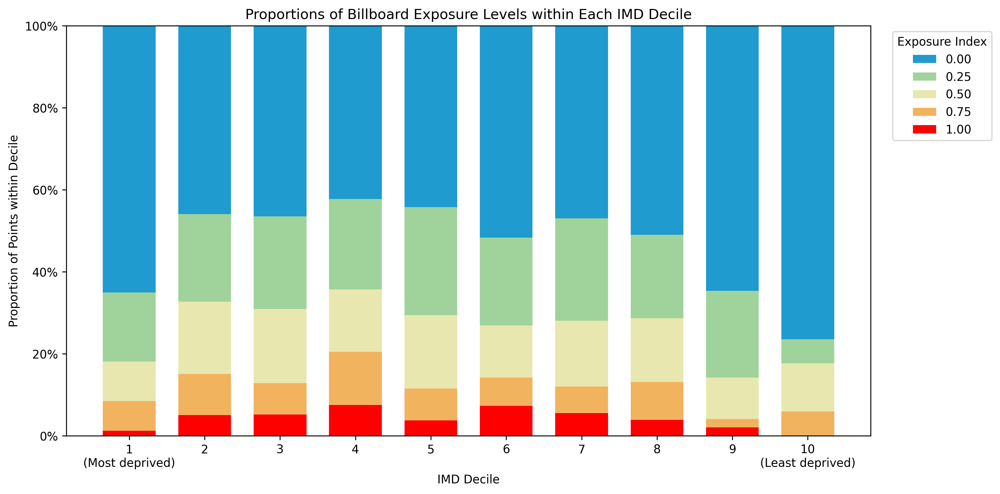

# Billboard Exposure Analysis

Portfolio-ready version of a master's project on billboard exposure analysis, prepared for public presentation and portfolio use.

## Research Question

How can billboard exposure be analysed by combining image-based methods, spatial context, and deprivation indicators?

This project investigates the spatial distribution and social patterning of billboard exposure, with a focus on linking visual features, mapped locations, and area-level deprivation measures.

## Project Snapshot

## Methods

- Image-based analysis to identify and classify billboard-related features
- GIS workflow to map billboard locations and spatial context
- Integration of IMD-linked area measures for comparative analysis
- Notebook-based analysis for transparent interpretation and reporting

## Key Findings

- Billboard exposure patterns can be studied more effectively when image outputs are interpreted together with mapped spatial context.
- Spatial inequalities become clearer when exposure indicators are compared across deprivation-linked groups.
- Visual outputs and GIS layers provide a stronger research narrative than tabular results alone.

## My Contribution

- Designed and structured the analysis workflow
- Conducted spatial analysis and GIS project preparation
- Organised notebook-based interpretation and reporting
- Produced figures for communicating results clearly to academic and non-technical audiences

## Repository Structure

- `notebooks/`: main analysis notebook
- `figures/`: selected figures for quick review
- `qgis/`: GIS project file
- `report/`: final PDF report

## Files Included

- [Main notebook](notebooks/billboard_exposure_analysis.ipynb)
- [Project report](report/Billboards.pdf)
- [QGIS project](qgis/billboards.qgz)

## Data Availability

Large datasets, compressed archives, and model weight files are excluded from this public version because of file size and repository suitability constraints.

A fuller version can be shared separately for academic review if needed.

## Skills Demonstrated

- Spatial analysis
- GIS workflow design
- Research framing
- Quantitative interpretation
- Notebook-based reporting
- Visual communication
